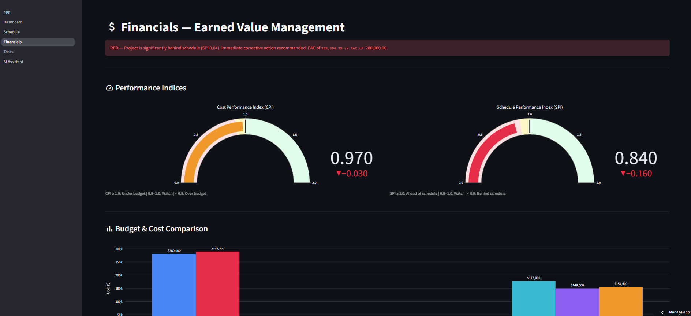
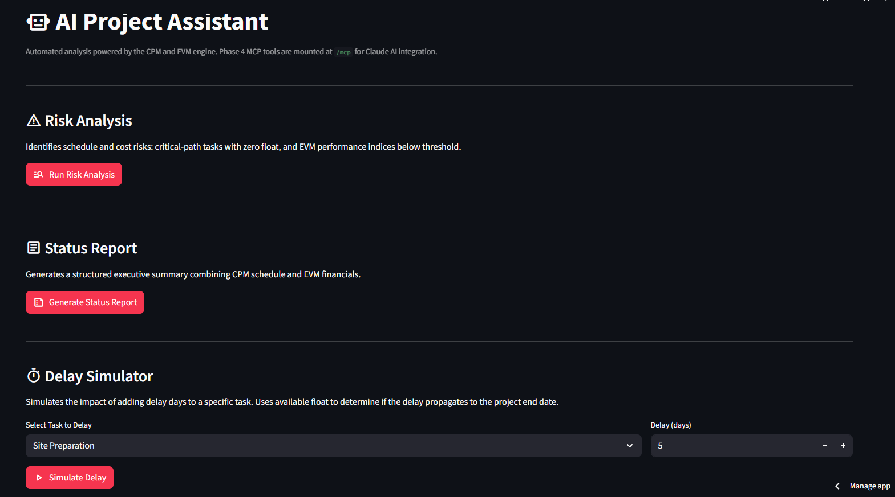

# auto_pm_tracker

Full-stack engineering project management tool — CPM scheduling, EVM financials, and AI assistant
integration via MCP. Built on FastAPI, Streamlit, SQLite WAL, and FastMCP.

[](https://github.com/delubobo/auto_pm_tracker/actions/workflows/test.yml)

**[Live Demo](https://autopmtracker.streamlit.app)** · **[API Docs](https://autopmtracker-production.up.railway.app/docs)**

---

## Screenshots

| Dashboard | Schedule (Gantt) |
|---|---|
|  |  |

| Financials | AI Assistant |
|---|---|
|  |  |

---

## Tech Stack

| Layer | Technology |
|---|---|
| Backend API | FastAPI 0.100+, SQLAlchemy 2.0, Alembic |
| Database | SQLite 3 (WAL mode, dual-access path) |
| Frontend | Streamlit, Plotly |
| AI Integration | FastMCP 1.0 (ASGI-mounted inside FastAPI at `/mcp`) |
| Scheduling | Kahn's topological sort + CPM forward/backward pass |
| Financials | Earned Value Management — per-task `percent_complete` |
| Containerization | Docker + Docker Compose |
| CI | GitHub Actions + pytest (FastAPI TestClient) |

---

## Architecture

### 1 — System Overview (Docker Compose)

```
  ┌──────────────────────────────────── docker-compose.yml ──────────────────────────────────────┐
  │                                                                                               │
  │  ┌──────────────────────────────────┐              ┌──────────────────────────────────────┐  │
  │  │  frontend            host :8501  │              │  backend               host :8001    │  │
  │  │  image: python:3.11-slim         │              │  image: python:3.11-slim             │  │
  │  │                                  │              │                                      │  │
  │  │  ENV API_BASE_URL=               │  httpx REST  │  uvicorn src.api.app:app             │  │
  │  │    http://backend:8000           │─────────────▶│  container port: 8000                │  │
  │  │                                  │              │                                      │  │
  │  │  streamlit run frontend/app.py   │  POST /mcp   │  ┌──────────────────────────────┐   │  │
  │  │  ┌──────────────────────────┐    │─────────────▶│  │  FastAPI routers             │   │  │
  │  │  │  1_Dashboard.py          │    │   (SSE/MCP)  │  │  /api/tasks   (ORM CRUD)     │   │  │
  │  │  │    EVM KPI + health band │    │              │  │  /api/schedule (CPM)         │   │  │
  │  │  │  2_Schedule.py           │    │              │  │  /api/financials (EVM)       │   │  │
  │  │  │    Plotly Gantt (CPM)    │    │              │  └──────────────┬───────────────┘   │  │
  │  │  │  3_Financials.py         │    │              │                 │  app.mount()      │  │
  │  │  │    CPI/SPI gauges, EAC   │    │              │  ┌──────────────▼───────────────┐   │  │
  │  │  │  4_Tasks.py              │    │              │  │  FastMCP ASGI at /mcp        │   │  │
  │  │  │    st.data_editor CRUD   │    │              │  │  7 AI tools (not a separate  │   │  │
  │  │  │  5_AI_Assistant.py       │    │              │  │  process — same uvicorn PID) │   │  │
  │  │  │    MCP tool call UI      │    │              │  └──────────────────────────────┘   │  │
  │  │  └──────────────────────────┘    │              │                                      │  │
  │  │                                  │              │  CMD: alembic upgrade head &&         │  │
  │  │  depends_on:                     │              │       uvicorn src.api.app:app         │  │
  │  │    backend: condition:           │              │                                      │  │
  │  │      service_healthy             │              │  healthcheck: urllib.request          │  │
  │  │    (Python urllib healthcheck)   │              │    GET /health → 200                  │  │
  │  └──────────────────────────────────┘              └──────────────────┬───────────────────┘  │
  │                                                                        │ volume mount         │
  │                                                    ┌───────────────────▼───────────────────┐  │
  │                                                    │  pm_data  (Docker named volume)       │  │
  │                                                    │  /app/data/project_schedule.db        │  │
  │                                                    │  WAL files: .db-shm  .db-wal          │  │
  │                                                    │  Persists across container restarts   │  │
  │                                                    └───────────────────────────────────────┘  │
  └───────────────────────────────────────────────────────────────────────────────────────────────┘
```

### 2 — Backend Internals (Dual Database Access)

A key design constraint: `cpm.py` and `services.py` predate SQLAlchemy and use raw `sqlite3`.
Rather than rewriting them, WAL mode is enabled at engine connect time so both access paths
coexist safely without locking conflicts.

```
  Incoming Request
        │
        ├── POST/GET /api/tasks ─────▶  SQLAlchemy 2.0 ORM
        │   POST/PATCH/DELETE           SessionLocal (autocommit=False)
        │                               get_db() FastAPI dependency
        │                               Task ORM model → tasks table
        │                                        │
        │                                        │  WRITE (INSERT/UPDATE/DELETE)
        │                                        │
        │                                        ▼
        ├── GET /api/schedule ──────▶  cpm.py
        │   GET /api/financials         sqlite3.connect(DB_PATH)
        │   POST /mcp (AI tools)        READ only — SELECT queries
        │                                        │
        │                                        │  READ
        │                                        │
        │                                        ▼
        │                         ┌──────────────────────────────────┐
        │                         │  project_schedule.db  (WAL mode) │
        │                         │                                  │
        │                         │  WAL enabled via SQLAlchemy      │
        │                         │  event listener on engine:       │
        │                         │    PRAGMA journal_mode=WAL       │
        │                         │                                  │
        │                         │  WAL allows concurrent readers   │
        │                         │  + one writer without blocking   │
        │                         │                                  │
        │                         │  tasks table — 13 columns:       │
        │                         │  ┌──────────────────────────┐   │
        │                         │  │ id              INTEGER  │   │
        │                         │  │ task_name       TEXT     │   │
        │                         │  │ status          TEXT     │   │
        │                         │  │ duration_days   INTEGER  │   │
        │                         │  │ dependency_id   INTEGER  │   │ ← legacy FK
        │                         │  │ predecessor_ids TEXT     │   │ ← JSON array [1,3]
        │                         │  │ start_date      TEXT     │   │
        │                         │  │ percent_complete REAL    │   │ ← 0.0–1.0 for EVM
        │                         │  │ project_id      INTEGER  │   │
        │                         │  │ task_type       TEXT     │   │
        │                         │  │ assignee        TEXT     │   │
        │                         │  │ planned_value   REAL     │   │
        │                         │  │ actual_cost     REAL     │   │
        │                         │  └──────────────────────────┘   │
        │                         │                                  │
        │                         │  Schema managed by Alembic       │
        │                         │  (Base.metadata.create_all       │
        │                         │   removed — Alembic is sole      │
        │                         │   schema authority)              │
        │                         └──────────────────────────────────┘
```

### 3 — CPM Computation Pipeline (`src/cpm.py`)

Standard CPM implementations assume tasks are stored in dependency order. This one does not —
it uses Kahn's algorithm to topologically sort the task graph before the forward pass,
making the schedule computation correct regardless of row insertion order.

```
  DB Read
  ─────────────────────────────────────────────────────────────────────────────
  SELECT id, task_name, duration_days, dependency_id, predecessor_ids
  FROM tasks ORDER BY id

  Parse predecessor_ids JSON column  →  fallback to dependency_id if empty
  Build task_map[id] = {es, ef, ls, lf, float, is_critical, successors[]}

  Kahn's Topological Sort
  ─────────────────────────────────────────────────────────────────────────────
  Compute in_degree[t] = len(predecessor_ids[t])

  queue ← all nodes where in_degree == 0   (root tasks, no predecessors)
  topo_order = []

  while queue:
      t = queue.popleft()
      topo_order.append(t)
      for each successor s of t:
          in_degree[s] -= 1
          if in_degree[s] == 0: queue.append(s)

  assert len(topo_order) == len(task_map)  ← cycle detection (DAG requirement)

  Forward Pass  (left → right through topo_order)
  ─────────────────────────────────────────────────────────────────────────────
  for t in topo_order:
      ES[t] = max(EF[p] for p in predecessors[t])   ← 0 if no predecessors
      EF[t] = ES[t] + duration[t]

  project_duration = max(EF[t] for all t)

  Backward Pass  (right → left through reversed(topo_order))
  ─────────────────────────────────────────────────────────────────────────────
  for t in reversed(topo_order):
      LF[t] = min(LS[s] for s in successors[t])     ← project_duration if no successors
      LS[t] = LF[t] - duration[t]
      Float[t]       = LS[t] - ES[t]
      is_critical[t] = Float[t] == 0
```

### 4 — EVM Computation (`src/services.py`)

```
  For each task row (status, planned_value, actual_cost, percent_complete):

    BAC += planned_value                         ← Budget at Completion (total)
    AC  += actual_cost                           ← Actual Cost (all tasks)

    if status == "Completed":
        EV += planned_value                      ← full budgeted value earned
        PV += planned_value

    elif status == "In Progress":
        pct = percent_complete ?? 0.5            ← per-task REAL column; PMBOK 50% fallback
        EV += planned_value × pct                ← partial earned value
        PV += planned_value                      ← was scheduled complete by today

  CPI = EV / AC          ← Cost Performance Index  (>1.0 = under budget)
  SPI = EV / PV          ← Schedule Performance Index (>1.0 = ahead of schedule)
  EAC = BAC / CPI        ← Estimate at Completion (forecast final cost)
  VAC = BAC - EAC        ← Variance at Completion
  CV  = EV  - AC         ← Cost Variance
  SV  = EV  - PV         ← Schedule Variance
```

---

## Key Engineering Decisions

**Kahn's Algorithm for CPM** — A standard forward pass assumes tasks are sorted
by dependency before they appear in the DB. Kahn's BFS topological sort makes this
assumption unnecessary: `ES = max(EF of all predecessors)` is always computed in correct
dependency order, supporting multi-predecessor tasks via a `predecessor_ids` JSON column
alongside the legacy `dependency_id` FK for backward compatibility.

**Per-task EVM `percent_complete`** — Earned value is computed from a per-task `REAL`
column (0.0–1.0) rather than the common PMBOK 50/50 rule. The 50% fallback remains for
`NULL` values, but every seeded task carries an explicit figure, yielding accurate SPI
and CPI on partially complete work packages.

**FastMCP mounted inside FastAPI** — The AI tool server is not a separate process.
`mcp.streamable_http_app()` returns a Starlette ASGI application; `app.mount("/mcp", ...)`
installs it as a sub-application inside the FastAPI instance. One `uvicorn` process serves
both REST and MCP with zero inter-process overhead.

**SQLite WAL + dual DB access coexistence** — `cpm.py` and `services.py` use raw `sqlite3`
connections (a consequence of pre-SQLAlchemy origin). WAL mode is enabled via an SQLAlchemy
event listener at engine connect time (`PRAGMA journal_mode=WAL`). WAL allows multiple
concurrent readers alongside a single writer, so ORM writes and raw-sqlite3 reads never
contend for an exclusive lock.

**Alembic as sole schema authority** — `Base.metadata.create_all()` was removed from
application startup. Alembic runs `upgrade head` before `uvicorn` in the Docker CMD.
`create_all` silently skips existing columns on live tables, masking stale-volume bugs
that surfaced during early Docker testing.

---

## Quick Start — Docker (Primary)

```bash
git clone https://github.com/delubobo/auto_pm_tracker.git
cd auto_pm_tracker
docker compose up --build -d

# Seed 18-task residential construction demo project ($280K BAC)
curl -X POST http://localhost:8001/api/admin/seed-demo

# Open dashboard
open http://localhost:8501          # macOS
xdg-open http://localhost:8501      # Linux
start http://localhost:8501         # Windows
```

Startup sequence is enforced: backend runs Alembic migrations → passes `/health` check
→ Compose starts frontend.

> **Live hosted version:** [autopmtracker.streamlit.app](https://autopmtracker.streamlit.app) (frontend) · [autopmtracker-production.up.railway.app/docs](https://autopmtracker-production.up.railway.app/docs) (API)

---

## Quick Start — Local Dev

```bash
python -m venv venv
source venv/Scripts/activate          # Windows
# source venv/bin/activate            # macOS/Linux

pip install -e ".[api,frontend,dev]"
alembic upgrade head

# Terminal 1
DEMO_MODE=true uvicorn src.api.app:app --reload --port 8000

# Terminal 2
streamlit run frontend/app.py

curl -X POST http://localhost:8000/api/admin/seed-demo
```

---

## API Reference

| Method | Endpoint | Description |
|---|---|---|
| `GET` | `/health` | Service health check |
| `GET` | `/api/tasks` | List all tasks |
| `POST` | `/api/tasks` | Create a task |
| `GET` | `/api/tasks/{id}` | Get task by ID |
| `PATCH` | `/api/tasks/{id}` | Partial update |
| `DELETE` | `/api/tasks/{id}` | Delete task (204) |
| `GET` | `/api/schedule/critical-path` | ES, EF, LS, LF, float, is_critical per task |
| `GET` | `/api/financials/evm` | BAC, PV, EV, AC, SPI, CPI, EAC, VAC, health narrative |
| `POST` | `/api/admin/seed-demo` | Seed 18-task demo (`DEMO_MODE=true` required) |

Interactive docs: [autopmtracker-production.up.railway.app/docs](https://autopmtracker-production.up.railway.app/docs)

---

## MCP Tools

Exposed at `https://autopmtracker-production.up.railway.app/mcp` for use with Claude and any MCP-compatible client (SSE/StreamableHTTP protocol — not browser-accessible):

| Tool | Description |
|---|---|
| `get_critical_path()` | Full CPM analysis with float values per task |
| `get_financial_health()` | EVM metrics + plain-English health narrative |
| `get_project_risks()` | Zero-float tasks + CPI/SPI thresholds → structured risk objects with severity |
| `simulate_delay(task_name, delay_days)` | Float absorption check — does delay propagate to project end? |
| `query_tasks_by_status(status)` | Filter tasks by `Completed` / `In Progress` / `Pending` |
| `get_cost_to_complete()` | ETC = EAC − AC with overrun narrative |
| `generate_status_report()` | Combined CPM + EVM structured report (health, schedule, financials) |

---

## Project Structure

```
src/
  api/app.py            # FastAPI app; app.mount("/mcp", mcp.streamable_http_app())
  api/routes/tasks.py   # CRUD — SQLAlchemy ORM path
  api/routes/schedule.py  # GET /api/schedule/critical-path
  api/routes/financials.py # GET /api/financials/evm
  core/config.py        # DATABASE_URL + DB_PATH from env; DEMO_MODE guard
  core/db.py            # SQLAlchemy engine, WAL event listener, get_db dependency
  models/task.py        # ORM model (13 columns)
  schemas/              # Pydantic v2 — TaskCreate, TaskUpdate, TaskResponse, CriticalPathResponse, EVMResponse
  cpm.py                # Kahn's topo sort → forward pass → backward pass
  services.py           # EVM: per-task percent_complete → CPI, SPI, EAC
  mcp_server.py         # FastMCP tool definitions (7 tools)
  demo_data.py          # 18-task residential construction seed ($280K BAC)
frontend/
  app.py                # Streamlit entry point; sidebar navigation
  api_client.py         # httpx wrapper; reads API_BASE_URL from env
  pages/                # 5 dashboard pages (Dashboard, Schedule, Financials, Tasks, AI Assistant)
migrations/
  versions/853db8178009_initial_master_schema.py  # Alembic — full 13-column schema
tests/
  test_api.py           # Smoke tests: health, CRUD, CPM, EVM (FastAPI TestClient)
```
